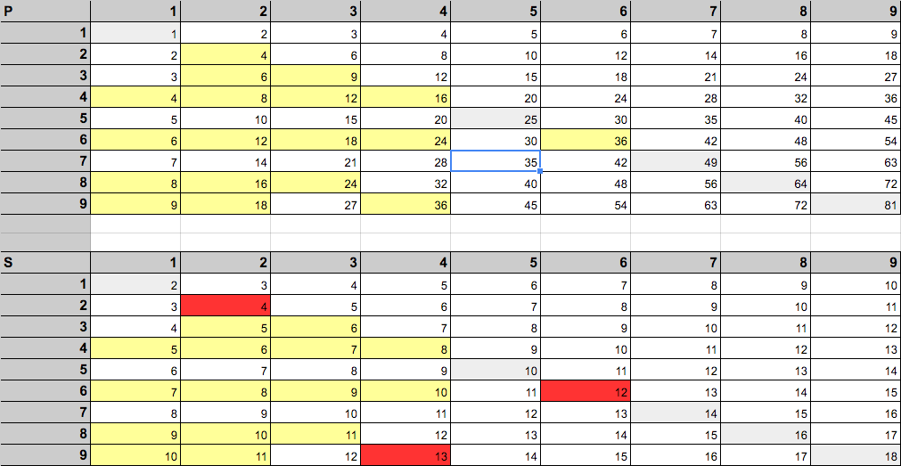
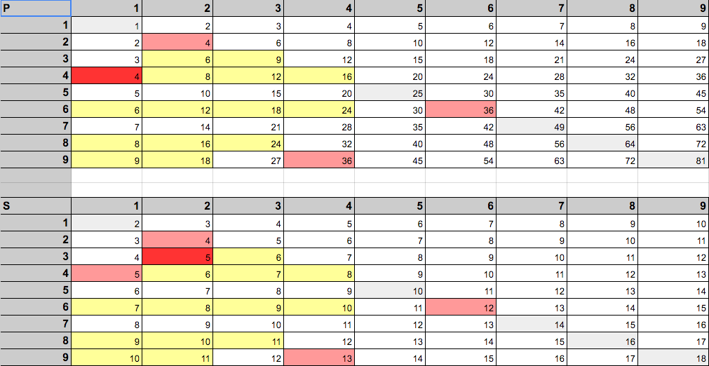
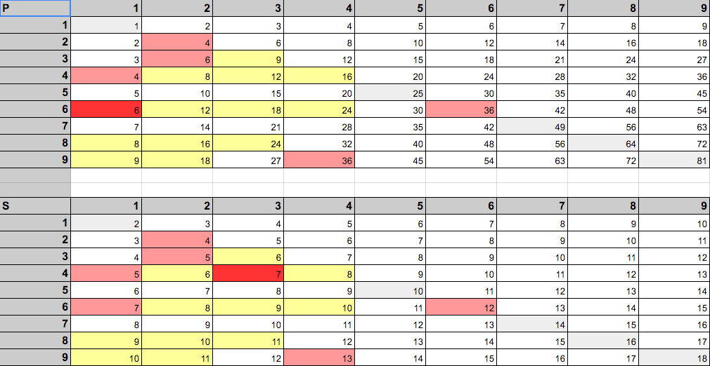
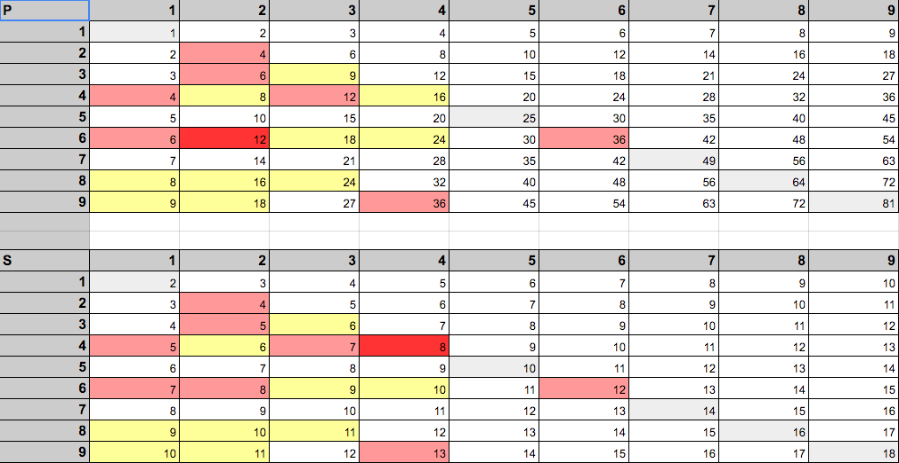
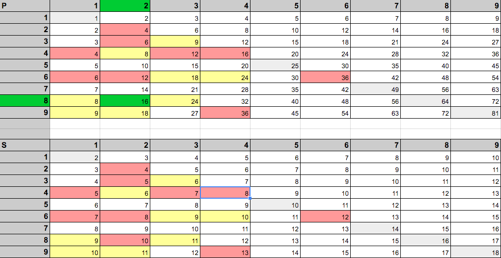

# The Riddler Puzzle

Three very skilled logicians are sitting around a table — Barack, Pete and Susan. Barack says: “I’m thinking of two natural numbers between 1 and 9, inclusive. I’ve written the product of these two numbers on this paper that I’m giving to you, Pete. I’ve written the sum of the two numbers on this paper that I’m giving to you, Susan. Now Pete, looking at your paper, do you know which numbers I’m thinking of?”

Pete looks at his paper and says: “No, I don’t.”

Barack turns to Susan and asks: “Susan, do you know which numbers I’m thinking of?” Susan looks at her paper and says: “No.”

Barack turns back to Pete and asks: “How about now? Do you know?”

“No, I still don’t,” Pete says.

Barack keeps going back and forth, and when he asks Pete for the fifth time, Pete says: “Yes, now I know!”

First, what are the two numbers? Second, if Pete had said no the fifth time, would Susan have said yes or no at her fifth turn?

source: [Can You Solve The Impossible Puzzle?](https://fivethirtyeight.com/features/can-you-solve-the-impossible-puzzle/)

## Solution

This is a visual representation of the turns between Pete (P) and Susan (S). On each turn, P goes first and then S takes her turn. The images below show two tables that display the possible combinations of two numbers between 1 and 9, inclusive, for the two logicians. For example, for Pete, 1 x 1 = 1, while for Susan, 1 + 1 = 2.

We only need to pay attention to the lower left diagonal half of the table because the upper right diagonal is redundant. In addition, any number combination that results in a unique product/sum (i.e. there is only one number combination that could result in that particular product/sum) is immediately eliminated because then P or S would already know Barack's number combination.

Yellow boxes indicate possible solutions, bright red boxes indicate solutions eliminated during that turn, and pink boxes indicate solutions eliminated during an earlier turn. Green boxes indicate the final solution.

### Turn 1

The strategy for P on his first turn is to highlight the remaining possible solutions to Barack's puzzle. He does this using yellow boxes.

P's possible remaining products: {4, 6, 8, 9, 12, 16, 18, 24, 36}

On S's first turn, she knows that P does not know the answer to Barack's puzzle. This causes her to reproduce the same set of possible solutions as P. However, because she cannot answer Barack's puzzle, we must also eliminate any of the yellow boxes that display a unique sum. These eliminated boxes are shown in bright red.

S' eliminated sums: {4, 12, 13}

S' possible remaining sums;: {5, 6, 7, 8, 9, 10, 11}

### Turn 2

On P's second turn (and on his future turns), he works off the S's inability to know Barack's number combination. Likewise, on S's second turn (and on her future turns), she works off of P's inability to know Barack's number combination.

Therefore, on turn 2, P eliminates the corresponding table cells that S crossed off. In addition, we need to eliminate any unique products on his table because he still does not know
Barack's number combination.

P's eliminated products: {4}

P's possible remaining products: {6, 8, 9, 12, 16, 18, 24, 36}

S takes her turn.

S' eliminated sums: {5}

S' possible remaining sums;: {6, 7, 8, 9, 10, 11}

### Turn 3

P takes his turn.

P's eliminated products: {6}

P's possible remaining products: {8, 9, 12, 16, 18, 24, 36}

S takes her turn.

S' eliminated sums: {7}

S' possible remaining sums;: {6, 8, 9, 10, 11}

### Turn 4

P takes his turn.

P's eliminated products: {12}

P's possible remaining products: {8, 9, 16, 18, 24, 36}

S takes her turn.

S' eliminated sums: {8}

S' possible remaining sums;: {6, 9, 10, 11}

### Turn 5

P knows the answer on this turn, meaning that he must have a unique product on his table. When we look at what possible number combinations he must have left, we see that (2, 8) is the only number combination that results in a unique product on his table.

First, what are the two numbers?

**The answer to Barack's puzzle must be (2, 8).**

Second, if Pete had said no the fifth time, would Susan have said yes or no at her fifth turn?

**Susan would have said "no" because her table does not contain any unique sums.**

#### Links
* [Google Spreadsheet](https://docs.google.com/spreadsheets/d/1oKVPzPVhKye9vGsJQDVg_IzyFFOQhDXRzz-dfIfXVZg/edit?usp=sharing) of all tables
* [Can You Solve The Impossible Puzzle?](https://fivethirtyeight.com/features/can-you-solve-the-impossible-puzzle/) by [Oliver Roeder](https://twitter.com/ollie) on [fivethirtyeight.com](https://fivethirtyeight.com/)
